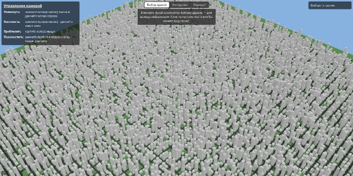

# WebGL City

Процедурно генерируемый 3D-город на **WebGL2** и **Angular**: рендеринг в реальном времени с тенями и инстансингом, орбитальная камера и три интерактивных инструмента — информация о здании, измерение расстояний и навигатор кратчайшего пути A→B по дорогам.

**Демо:** https://tmot24.github.io/webgl-city/

<!-- Вставить сюда скриншот/гифку -->


---

## Что реализовано

### Рендеринг (WebGL2)
- **Инстансинг** — весь город (тысячи зданий) рисуется одним `drawElementsInstanced`; на инстанс передаются только позиция и габариты, модельная матрица собирается в вершинном шейдере.
- **Тени (shadow mapping)** — отдельный depth-пасс из «взгляда солнца» в depth-текстуру, мягкие края через PCF, slope-scaled bias и front-face culling против самозатенения, карта теней **привязана к камере** для резкости у точки обзора.
- **Освещение** — направленный свет по модели Half-Lambert (мягкий терминатор, читаемые затенённые грани), затенение только освещённых поверхностей.
- **Процедурная генерация** — детерминированная (по seed) сетка кварталов, дорог и зданий разной высоты.
- **Реактивный рендер** — перерисовка кадра только при изменении состояния (камера, выделение, маршрут), без постоянного цикла.

### Взаимодействие
- **Орбитальная камера** — орбита, зум и пан, реализованные через сферические координаты и сигналы.
- **Пикинг** — выбор здания лучом из камеры и пересечением с AABB (ray–box), панель с высотой, размерами и координатами.
- **Измерение расстояний** — постановка точек на поверхности, «резинка» за курсором, лог измерений и **прилипание** к углам зданий и перекрёсткам (снепинг в экранных пикселях).
- **HTML-подписи над сценой** — проекция 3D-точек в экранные координаты и вывод текста обычным HTML поверх canvas.

### Алгоритмы
- **Граф дорог** — явная структура из узлов (перекрёстки) и взвешенных рёбер, построенная из сетки дорог.
- **Поиск пути A\*** — навигатор A→B по графу с допустимой эвристикой (евклидово расстояние) и приоритетной очередью на **бинарной min-куче**; гарантированно кратчайший маршрут.

### Angular
- **Zoneless + сигналы** — реактивность и рендер построены на сигналах, без Zone.js.
- **Связка WebGL ↔ UI** — панели, подсказки и переключатель режимов на Angular-компонентах поверх canvas, состояние — через сигналы.
- **Feature-based архитектура** — код разбит по доменам и фичам с однонаправленными зависимостями.

---

## Ключевые технические решения

- **Инстансинг вместо тысяч draw call.** Один куб рисуется на весь город за один вызов; за счёт `vertexAttribDivisor` per-instance данные (позиция, размер) идут отдельным потоком — это держит частоту кадров при тысячах зданий.
- **Тени, привязанные к камере.** Статичная карта теней на весь город упирается в компромисс «охват vs разрешение», поэтому ортобокс карты следует за фокусом камеры и масштабируется зумом — резкость там, где смотришь.
- **Снепинг в экранных пикселях.** Кандидаты прилипания проецируются в экранные координаты, и близость меряется в пикселях, а не в метрах — прилипание одинаково лёгкое на любом расстоянии и зуме.
- **A\* с гарантией кратчайшего.** Эвристика (прямое расстояние до цели) допустима, поэтому путь гарантированно оптимален; приоритетная очередь — на бинарной min-куче, а дубликаты в очереди гасятся ленивым удалением вместо дорогого decrease-key.
- **Реактивный рендер.** Сцена перерисовывается только на изменение сигналов (движение камеры, состояние инструментов), а не в постоянном `requestAnimationFrame` — меньше нагрузки в покое.
- **Единый UI-слой.** Общий стиль панелей и типографика вынесены в токены; каждый инструмент — отдельная фича со своей панелью, включаемой по активному режиму.

---

## Архитектура

Код организован по доменам, а не по типам файлов, с тонким переиспользуемым ядром:

```
shared/       переиспользуемое ядро: математика, GL-обёртки, геометрия, лучи, структуры данных
city/         домен «город»: генерация, инстанс-данные, граф дорог, A*
render/        WebGL-рендер сцены: рендереры, материалы, шейдеры
camera/        орбитальная камера и обработчики ввода
interaction/   общий ввод по canvas (лучи из кликов)
features/      инструменты-режимы: выбор здания, измерение, маршрут
app/           Angular-оболочка и сцена
```

Зависимости идут строго в одну сторону: `app → features → домены → shared`. Фичи независимы друг от друга, ядро (`shared`) не знает о доменах — граф зависимостей без циклов.

---

## Управление

| Действие | Как |
| --- | --- |
| Повернуть камеру | правая кнопка мыши + движение |
| Наклонить | правая кнопка мыши вверх/вниз |
| Приблизить/отдалить | колесо мыши |
| Переместить (пан) | пробел + левая кнопка мыши |
| Выбрать инструмент | переключатель режимов сверху |
| Сбросить действие режима | Esc |

Режимы: **выбор здания** (клик → информация), **измерение** (два клика → расстояние, точки прилипают к углам и перекрёсткам), **маршрут** (две точки на дорогах → кратчайший путь).
