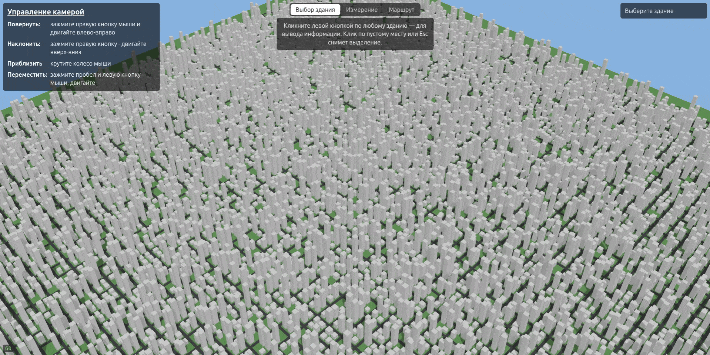

# WebGL City

Процедурно генерируемый 3D-город на **WebGL2** и **Angular**: рендеринг в реальном времени с тенями и инстансингом, орбитальная камера и три интерактивных инструмента — информация о здании, измерение расстояний и навигатор кратчайшего пути A→B по дорогам.

**Демо:** https://tmot24.github.io/webgl-city/

<!-- Вставить сюда скриншот/гифку -->


---

## Что реализовано

### Рендеринг (WebGL2)
- **Инстансинг** — весь город (тысячи зданий) рисуется одним `drawElementsInstanced`; на инстанс передаются только позиция и габариты, модельная трансформация (масштаб + перенос) применяется прямо в вершинном шейдере.
- **Тени (shadow mapping)** — depth-пасс из позиции солнца, мягкие края (PCF 3×3), защита от «теневого акне» (bias + front-face culling); область теней следует за камерой, поэтому вблизи они резкие.
- **Освещение** — направленный свет по модели Half-Lambert (мягкий терминатор, читаемые затенённые грани), затенение только освещённых поверхностей.
- **Процедурная генерация** — детерминированная (по seed) сетка кварталов, дорог и зданий разной высоты.
- **Реактивный рендер** — перерисовка кадра только при изменении состояния (камера, выделение, маршрут), без постоянного цикла.

### Взаимодействие
- **Орбитальная камера** — орбита, зум и пан, реализованные через сферические координаты и сигналы.
- **Пикинг** — выбор здания лучом из камеры и пересечением с AABB (ray–box), панель с высотой, размерами и координатами.
- **Измерение расстояний** — постановка точек на поверхности, «резинка» за курсором, лог измерений и **прилипание** к углам зданий и перекрёсткам (снепинг в экранных пикселях).
- **HTML-подписи над сценой** — проекция 3D-точек в экранные координаты и вывод текста обычным HTML поверх canvas.

### Алгоритмы
- **Граф дорог** — явная структура из узлов (перекрёстки) и взвешенных рёбер, построенная из сетки дорог.
- **Поиск пути A*** — навигатор A→B по графу с допустимой эвристикой (евклидово расстояние) и приоритетной очередью на **бинарной min-куче**; гарантированно кратчайший маршрут.

### Angular
- **Zoneless + сигналы** — реактивность и рендер построены на сигналах, без Zone.js.
- **Scoped store на `@ngrx/signals`** — состояние сцены разбито на слайсы по фичам (режим, здание, измерение, маршрут) и живёт в `providers` компонента сцены: создаётся и уничтожается вместе с ней, снаружи недоступно.
- **Связка WebGL ↔ UI** — панели, подсказки и переключатель режимов на Angular-компонентах поверх canvas; компоненты и рендер читают состояние напрямую из сторов, без прокидывания props.
- **Feature-based архитектура** — код разбит по доменам и фичам; каждая фича содержит свой стор, обработку ввода и UI.
---

## Ключевые технические решения

- **Инстансинг вместо тысяч draw call.** Один куб рисуется на весь город за один вызов; за счёт `vertexAttribDivisor` per-instance данные (позиция, размер) идут отдельным потоком — это держит частоту кадров при тысячах зданий.
- **Тени, привязанные к камере.** Статичная карта теней на весь город упирается в компромисс «охват vs разрешение», поэтому ортобокс карты следует за фокусом камеры и масштабируется зумом — резкость там, где смотришь.
- **Снепинг в экранных пикселях.** Кандидаты прилипания проецируются в экранные координаты, и близость меряется в пикселях, а не в метрах — прилипание одинаково лёгкое на любом расстоянии и зуме.
- **Поиск пути A*** — навигатор A→B по графу; эвристика — евклидово расстояние (согласованная: оценка при шаге по ребру уменьшается не больше, чем длина этого шага), поэтому маршрут гарантированно кратчайший; приоритетная очередь на **бинарной min-куче** с ленивым удалением дубликатов.
- **Реактивный рендер.** Сцена перерисовывается только на изменение сигналов (движение камеры, состояние инструментов), а не в постоянном `requestAnimationFrame` — меньше нагрузки в покое.
- **Единый UI-слой.** Общий стиль панелей и типографика вынесены в токены; каждый инструмент — отдельная фича со своей панелью, включаемой по активному режиму.
- **Стор, привязанный к сцене, а не глобальный.** Сторы (`signalStore`) регистрируются в `providers` компонента `Scene`, а не в `root`: состояние живёт ровно столько, сколько сцена, и недоступно вне её дерева. Каждая фича владеет своим слайсом; корневой `SceneStore` содержит только то, что связывает слайсы (активная линия для рендера, сброс по Esc).
- **Однонаправленный поток данных.** Состояние меняется только через методы сторов (`protectedState`): клик по canvas → луч и пересечения (или A*) → метод стора → сигналы → UI и перерисовка. Тяжёлые вычисления (пересечения, поиск пути) остаются вне стора, в стор попадает только результат.
- **Доменное состояние отдельно от проекции.** В сторах хранятся мировые координаты; перевод в экранные (подписи, маркер прилипания) делает `SceneViewport` — доступ к камере через DI, а не часть состояния.
---

## Архитектура

Код организован по доменам, а не по типам файлов, с тонким переиспользуемым ядром:

```
app/           Angular-оболочка и сцена
store/         корневой стор сцены: связывает слайсы фич
features/      инструменты-режимы: выбор здания, измерение, маршрут — у каждого свой стор, ввод и UI
render/        WebGL-рендер сцены: рендереры, материалы, шейдеры, SceneViewport (проекция мир → экран)
camera/        орбитальная камера и обработчики ввода
interaction/   общий ввод по canvas (лучи из кликов)
city/          домен «город»: генерация, инстанс-данные, граф дорог, A*
shared/        переиспользуемое ядро: математика, GL-обёртки, геометрия, лучи, структуры данных
```


### Состояние

Состояние сцены хранится в сторах на `@ngrx/signals`, по одному на фичу:

| Стор | Что хранит |
| --- | --- |
| `SceneModStore` | активный режим и флаги `is.building` / `is.measure` / `is.route` |
| `BuildingStore` | выбранное здание |
| `MeasureStore` | измерения, незавершённый отрезок, точка прилипания |
| `RouteStore` | точки A/B и найденный путь |
| `SceneStore` | своего состояния нет: активная линия для рендера и сброс действия по Esc |

Все сторы зарегистрированы в `providers` компонента `Scene` — это **scoped store**: один экземпляр на сцену, уничтожается вместе с ней, `inject()` вне дерева сцены даёт ошибку. Изменить состояние можно только методами стора.

Поток данных однонаправленный:

```
клик по canvas → inject* (луч, пересечения, A*) → метод стора → сигналы → компоненты UI и рендер
```

Каждая папка зависит только от тех, что ниже неё в списке; ядро (`shared`) не знает ни о ком.
## Управление

| Действие | Как |
| --- | --- |
| Повернуть камеру | правая кнопка мыши + движение |
| Наклонить | правая кнопка мыши вверх/вниз |
| Приблизить/отдалить | колесо мыши |
| Переместить (пан) | пробел + левая кнопка мыши |
| Выбрать инструмент | переключатель режимов сверху |
| Сбросить действие режима | Esc |

Режимы: **выбор здания** (клик → информация), **измерение** (два клика → расстояние, точки прилипают к углам и перекрёсткам), **маршрут** (две точки на дорогах → кратчайший путь).
