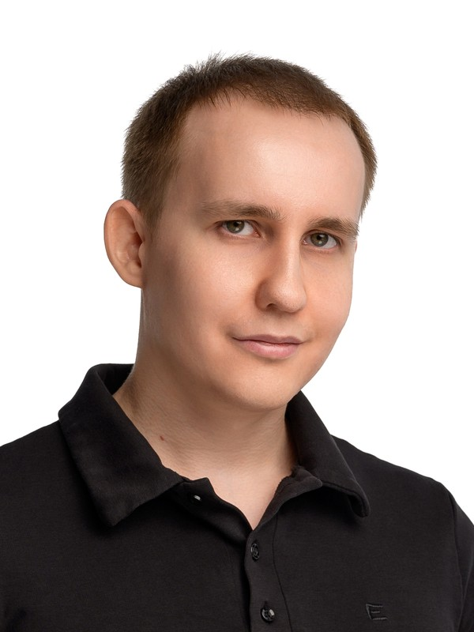

# Яковлев Григорий Валерьевич

**Frontend-разработчик · Angular · WebGL / интерактивная 3D-графика**

Санкт-Петербург · 24 мая 1996 · **только удалённо** · английский B1\
Telegram: [@ya_grisha](https://t.me/ya_grisha) (предпочтительно) · grigory.yakovlev96@gmail.com · +7 (931) 367-19-94

**Пет-проект WebGL City** — процедурный 3D-город на чистом WebGL2 + Angular, открывается прямо в браузере\
Демо: [tmot24.github.io/webgl-city](https://tmot24.github.io/webgl-city/) · Код: [github.com/tmot24/webgl-city](https://github.com/tmot24/webgl-city)

---

## Кратко

5+ лет коммерческой фронтенд-разработки: сложные интерактивные визуализации и редакторы схем на SVG, производительность на больших объёмах данных, микрофронтенд-архитектура и настройка сборки. Коммерческий стек — React. Целевое направление — Angular и WebGL2, подтверждённое опубликованным пет-проектом (signals, zoneless, @ngrx/signals).

---

## Навыки

**Целевой стек:** Angular (v21/v22, signals, zoneless, @ngrx/signals), WebGL2, GLSL, gl-matrix.\
**Графика и визуализация:** JointJS, uPlot, Chart.js, Leaflet, GeoToolkit, SVG.\
**Сборка и архитектура:** Vite, Webpack, Module Federation, микрофронтенды.\
**Коммерческий бэкграунд:** TypeScript, JavaScript, React.\
**Прочее:** REST, WebSocket, GraphQL, Node.js / NestJS, Git. Учебно: Three.js, Babylon.js.

---

## Пет-проект — WebGL City

**Процедурный 3D-город на чистом WebGL2 (без движка) + Angular**

Город генерируется по seed и рендерится в реальном времени. Есть orbit-камера и три инструмента: выбор здания, измерение расстояний и навигатор кратчайшего пути A→B.

- **Рендеринг:** весь город (тысячи зданий) рисуется одним `drawElementsInstanced`. Динамические тени (shadow mapping): depth-пасс, PCF-сглаживание, slope-scaled bias, карта теней привязана к камере. Освещение Half-Lambert.
- **Взаимодействие:** пикинг зданий лучом (ray–AABB) с панелью свойств. Измерение расстояний со снепингом к углам зданий и перекрёсткам. HTML-подписи поверх canvas через проекцию world→screen.
- **Навигатор A→B:** явный граф дорог и поиск кратчайшего пути A\* с допустимой эвристикой на бинарной min-куче.
- **Angular:** zoneless + signals. Рендер реактивный: перерисовка только при изменении состояния, в покое нагрузки нет. Feature-based архитектура с однонаправленными зависимостями.
- **Состояние (@ngrx/signals):** scoped store — слайсы по фичам зарегистрированы в `providers` компонента сцены и живут вместе с ней. Поток однонаправленный: клик → луч / A\* → метод стора → сигналы → UI и рендер. Тяжёлые вычисления остаются вне стора.
- **Доменное состояние отделено от проекции:** в сторах хранятся мировые координаты, в экранные их переводит `SceneViewport` через DI. Рендер получает готовые сигналы и о сторах не знает.

---

## Опыт работы — 5 лет 4 месяца

### Сатурн Индастрис — Старший разработчик ПО
*Август 2024 — настоящее время (2 года 2 месяца)*

**АРМ КИП** — микрофронтенд для работы персонала с контрольно-измерительными приборами промышленного оборудования.\
*Стек: React, TypeScript, Vite, JointJS, Chart.js, TanStack Table.*

- Переписал с нуля визуальный сценарий-тренажёр на **JointJS** (редактор схем на SVG) в микрофронтенде соседней команды: устранил жёсткую связанность, улучшил читаемость и масштабируемость, сохранил API с backend.
- Разработал компонент **виртуализированных таблиц до 10 000 строк** и вынес его в общий пакет для микрофронтендов и core-репозитория.
- Инициировал и выполнил миграцию сборки с **Webpack на Vite**.
- Спроектировал и реализовал сквозной **модуль уведомлений** в core-репозитории (WebSocket + REST).
- Разработал модули «Оборудование», «Метрология», «Отказы», «ТОиР».
- Проводил code review, прорабатывал UI/UX и API-контракты с аналитиками и backend.

### Nedra Digital — Frontend-разработчик
*Июнь 2021 — Август 2024 (3 года 3 месяца)*

**Мониторинг бурения** — микрофронтенд для визуализации процесса бурения по потоку WITSML.\
*Стек: React, TypeScript, Webpack, Module Federation, uPlot.*

- Реализовал **графики большого объёма данных на uPlot**; устранил утечку памяти при прокрутке, оставив рендер только видимой области.
- Оптимизировал bundle Webpack, донастроил **Module Federation** для микрофронтенд-сборки.
- Разработал дашборды с виджетами и drag-and-drop.
- Писал технические дизайны сложных задач (декомпозиция, интерфейсы, способы решения), проводил code review.

**ГРАД WEB** — интеграционная платформа с онтологической моделью данных для геологии и разработки месторождений; поддерживает плагины сторонних разработчиков.\
*Стек: React, TypeScript, NestJS, MongoDB.*

- Разработал компоненты SDK платформы для создания плагинов и плагины «Рейтинг бурения», «Расчёт экономики», «Окно синхронизации данных».
- Участвовал в проектировании онтологической модели данных: сущности, связи, схема.
- Реализовал BFF-слой на NestJS для интеграции со сторонним сервисом.

**Платформа данных Nedra** — хранение и отображение геологических данных.\
*Стек: React, TypeScript, Leaflet, GeoToolkit.*

- Интегрировал виджеты **GeoToolkit** и реализовал отображение объектов на карте (**Leaflet**).

---

## Образование

**Магистр, 2020** — СПбГЭУ, Экономика · Анализ данных в экономике\
**Бакалавр, 2018** — СПбГЭУ, Экономика · Бухгалтерский учёт, анализ и аудит
